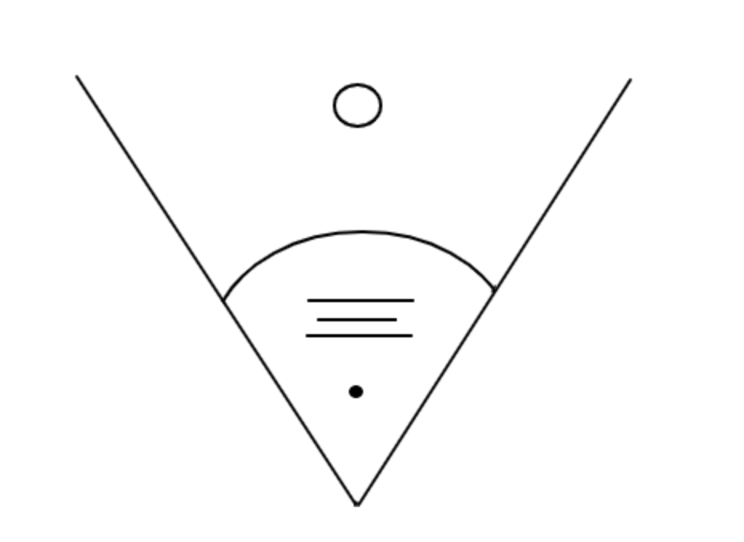

# Felix Dalby Bowler
[Projects](##projects) | [Skills](##skills) | [History](#history) | [Interests](#interests)

I'm a young eager recent graduate of Makers Academy, looking to collaberate and excel with others. I crave a workplace that I can fully immerse myself in, learn from and contribute to. I am keen to evolve the knowledge I've collected, and I believe if I can find the right environment I can continue this rapid progression.

While at Makers Academy I became fond of Javascript and particularly React, as I believe it embodies a lot of coding principles and generally breeds clean code. On the otherhand in a new environment, I'd love to learn more further develop my stack and really take advantage of the new seniors and peers that I will have around me. Thats not to say I cannot work independantly, I have the methodical approach needed to learn independantly. I enjoy working within a team, using Agile (scrum) methodologies to increase work flow and structure the devlopment process.

## Projects

| Name                                                                    | Time (weeks) | Stack                                                          | Deployed                                              | Description                                                                                                                                                                                                          |
| ----------------------------------------------------------------------- | ----------- | -------------------------------------------------------------- | ----------------------------------------------------- | -------------------------------------------------------------------------------------------------------------------------------------------------------------------------------------------------------------------- |
| [MakersRich](https://github.com/toddpla/makersrich)                     | 2           | Javascript (React & Redux), Firebase, Jest, Cypress, HTML, CSS | [MakersRich](https://makerzrich.firebaseapp.com/game) | A educational role play game, teaching up and coming coders the basics of Ruby and JavaScript, making use Firebase to enable realtime multiplayer.                                                                   |
| [Busy Politicians](https://github.com/rekapap/acebook-busy-politicians) | 2           | Ruby on Rails, JavaScript, HTML, CSS, Rspec                           | [bp-acebook](https://bp-acebook.herokuapp.com/)       | A clone of Facebook, users are able to post to a feed or a user wall (much like facebook). Posts can then be commented on/liked etc. This was good practice for handling HTTP requests and loading HTML dynamically. |
| [MakersBnB](https://github.com/felixjtdb/MakersBnB)                     | 1           | Javascript, HTML, CSS, Zombie                                          |                                                       | A clone of AirBnB, being able to list a property with details such as location, etc and then a client being able to book that for certain dates.                                                                     |

## Skills
### Communication

Growing up as the youngest in a family of 7, I think it's fair to say I have strong soft skills. At Makers we embodied Agile methodologies, having frequent stand ups and retros, communicating about why we didn't meet estimations so that we can progress and improve for the next sprint. Stressful team dynamics can arise when under time constraints, but with the right communication and encouragment I believe an intense work environment can produce the most gratifying results.

During my final project at Makers, we had the realisation that we had taken on a hefty workload and the deadline was rapidly approaching; seperating work streams as much as possible for productivity became a neccesity and having a holistic understanding of the code though communication and code review became second nature, I loved working on MakersRich. Peer feedback is huge at Makers and I'm told I make the work environment more enjoyable while still giving the project momentum and direction.

#### Meticulous and Methodical

When approaching a problem I instincively modulate and break it down so we have more achievable solutions. When blocked or lacking understanding, I have the compentance and drive to find the solution independantly, traversing the endless amounts of information there is on any given topic on the internet. I believe this skill is enhanced when in a team, being meticulous when reviewing code and being methodical when explaining or justifying your approach to others.

I have experience with test driven development, using a variety of testing frameworks - such as: Rspec, Cypress, Jest, Jasmine, unittest and Zombie. I understand the process satisfying user requirements with feature testing and creating minimilistic code through unit testing.

## History
#### Makers Academy (September 2018 - December 2018)
- A 16 week intensive coding bootcamp
- OOP, TDD, MVC, DDD
- Agile/XP
- Ruby, Rails, JavaScript
- RSpec, Jasmine, pSQL

#### Work Placement at Northcross Capital LLP, September 2017 - January 2018
- I saved the workers on trading desk time by automating calculations on excel spreadsheets using VBA, graphically generating predictions and current assets.
- Generally helping with client communication, sending formal emails and helping organise meetings for potential clients.

#### Cask London Staffing

#### Alleyn’s School, 2010 - June 2017
Computer Science - C  
Psychology - C  
Mathematics - D  
GCSEs: A, A, B, B, B, B, B, B, C, C

## Personal Experience
- National Citizens Service 2015, this helped me learn to make key decisions for me and a group when it came to planning and executing a project.
- 1st XI Hockey for Alleyn's School.
- County level hockey player for 2 years.
- Volunteering, I have supported my community in different ways: helping the elderly through sessions that teach the use of computers in general, helping at 'FunFizz' an after-school club and at Watergate School, both of which are for children with learning disabilities. Outside of my local community, I have visited Athens helped out an organisation called [Khora](http://www.khora-athens.org/) which supports refugees in multiple ways, from lessons to meals.

### Interests
- I enjoy playing chess as its meticulous nature and robust logic is beautiful.
- Rock climbing on shorter routes that are a bit harder is called boulderin. I really like the process of working out a solution to a route.
- I like gaming but my recent switch to Linux is making it difficult.
- Love a good cup of coffe.

 FDB
